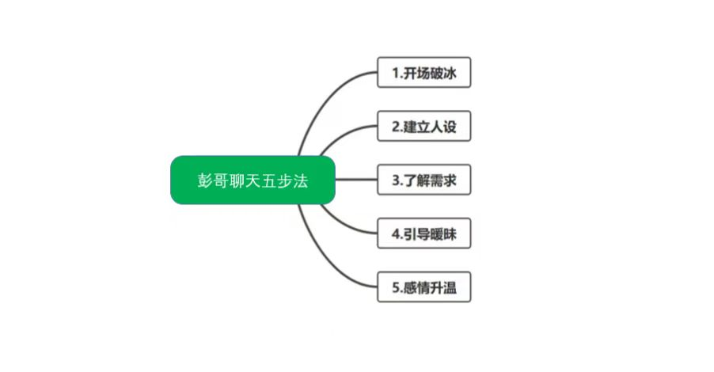

# 男神蜕变

- 要有自己的框架

- 不要等待女人主动，也不要被女人的嘴蒙蔽双眼

## 聊天思路讲解

### 聊天五步法

- 确定五个阶段: **陌生-朋友-亲密-舒适-暧昧-确实关系**

- 聊天方向：**聊天方向要明确，不要在聊天中迷失方向**
  

### 聊天技巧讲解

- 破冰: 简单而与众不同

  - 不要吃了吗，在干嘛，叫什么开场
  - 可以用个表情包来测试女生是否感兴趣

- 植入人设：

- 了解需求：交换信息，了解对方的需求，比如：爱好，职业，性格，家庭，爱好，价值观，人生观，对未来的规划
  植入大手拉小手，

- 引导暧昧：朋友和暧昧用什么过度？

- 感情升温

### 实战案例讲解

## 问题

1. 女生为什么喜欢跟阿尔法男人在一起，而不是对自己好的贝塔男？
   女人她永远都会找。比自己强或者高于自己的男人，因为女人她有着木强择偶的天性，这个是基因决定的。

2 你以前是用贝塔男的方式跟异性相处（聊天），还是阿尔法男的方式？
肯定是贝塔男

3. 女人具有两面性，分别是那两面？
   就像潘金莲，如果没有遇到阿尔法男人，或者比当前更加强大的男人，她就会一直停留在贝塔男身边，直到遇到一个比她强的男人，她才会离开

4. 五步聊天法分别是什么

破冰，植入人设，了解需求，引导暧昧，感情升温

## 1. 追女生最不能犯的低价值错误行为

## 2. 不要过早暴露需求感

## 3. 不要漫无目的的聊天

- 不要想到什么就聊什么，要明确聊天目的，比如：了解对方，引导暧昧，感情升温，建立关系等。

## 聊天的目的:

- 孔雀开屏
- 展示自己的优点，自己的长处，擅长的点，自己的价值，自己的魅力
- 要通过聊天去展示你自己的长处，你的优点，同时，你要了解这个女生，她的一些兴趣爱好，我们所谓的衣食住行这些兴趣等等

## 不要患得患失

## 女生不回消息的原因:

- 真的没时间看手机聊天
- 对你说的话题不感兴趣
- 对我们这个人不感兴趣

## 男神心态建设

- 1.事不过三法则
- 2.以自我为中心，提升自己

> 价值是一个人的核心，一个人没有价值也就没有人会想去了解接触这个人，无论你是谈恋爱，交朋友谈生意都离不开价值，尤其是追女生的过程当中，也没有几个人会跳过外在看你的内在，所以一个人的形象包括自身的内在价值都很重要，首先要有一个好的包装外壳，才有人愿意去打开你这个盒子，那当别人打开你盒子后，发现空空如也，或者只是一根稻草，那就没有任何的兴趣了 所以我们得清楚，价值很重要 我们是想一个问题，如果街边有一个乞丐，他的情商很高，很会说话，但是她没有一个好的外在，邋里邋遢，可能离他三五米内，还能够闻到酸臭味，你想去了解这种人？我想你不会我也不会，所以不要再跟彭哥讲，我不怎么发朋友圈，我穿衣服比较随便，我这个头像用了很多年，我觉得我长得还可以，我觉得我聊天还行等等 该去改就去改 要么社会，迫使你改变学习，要么你自己主动接受适应，在这里很多兄弟是被环境所影响，世俗价值观，包括传统价值观所拘束。我们要做建立规则的阿尔法男，而不是做那个对女人言听计从、俯首称臣的贝塔男

## 我们为什么要跟女生聊天？

- **价值=吸引=聊天**

- **约束感与自在感**

- **坦诚和神秘感**

- **委屈感与侵略感**

1、跟异性沟通是需要展示出那些价值，你目前具备哪些价值：
需要展示自己长处和优点以及特长，闪光点等，包括内在和外在价值

价值观正，唱歌好听，注重细节，积极向上，爱旅游， 衣品好，干净，

2、坦诚对待女生后会得到什么结果：
会让对方的觉得像明星一样让你高攀不起，导致自己成为一个价值感很低的人，跪舔男，屌丝

3、给你一次选择，你想成为，阿尔法男还是贝塔男，以及告诉彭哥为什么：
阿尔法，阿尔法男才能够让女生离不开你，让你有更大的魅力，让女生上头
4、聊天聊的好与坏是否会让一个女生喜欢上你？
不会
5、让女生喜欢上你的原因是什么？
自身有价值，能够吸引女生，保持神秘感，打破规则，雄性极性特质

## 开场白

> 文字：陌生阶段开场：
        ①Hi~/轻松愉悦有趣的表情和表情包   （正常开场）
        ②第一眼，是心动的类型             （撩人开场）
       《发几个可爱的表情包》

### 开场白三种情况
  - 第一种就是女生不回信息，就是我们要跟她开完场之后，她不回信息了
  - 第二种回复的比较冷淡，回no哈哈哈，或者一个表情包，或者你给他发个表情包，他也回你个表情包，这个叫什么呢？冷淡的回复
  - 第三种是回复的比较热情的。也就是我们对女生有兴趣，他也对我们有兴趣

> 根据女生回复的冷淡状态采取相应的对应方法

### 不回复的原因
  - 1可能女生真的在忙
  - 2可能对你不感兴趣

### 处理方式：
  - ①隔两到三个小时再打一个招呼②第二天价值展示一下女生反应好：继续延续话题按照框架互动聊下去
  - 女生反应差：抛出的话题并不是女生感兴趣的，先暂停聊天再找机会开启话题

### 回复冷淡的原因
  - 1可能是礼貌性回复(并不是对你没兴趣)
  - 2对于话题不感兴趣（觉得话题无聊不想参与）
  - 3对于你本身不感兴趣（觉得你价值低不想投入精力）

### 处理方式：
  - ①利用第二个框架开启话题，根据女生的兴趣爱好，聊女生喜欢的话题
  - ②适当价值展示，让女生觉得你不是屌丝直男，值得她和你聊天

### 回复热情的原因
  - 1 她本身的性格就是开朗，自来熟，对人都是很热情的
  - 2 只针对你一个人感兴趣，热情

### 处理方式：
    根据她的回复然后按照八大框架一步步往下聊

> 当女生对你产生不了兴趣那我们就必须要提升自我价值了。而不是一直逼逼个没停。女生对你回复冷淡你啥情况你都不知道。还在一个人自嗨。你换来的就是女生对你越来越冷淡。最后把你拉黑。

## 开启话题

  通过看女生的朋友圈去开启话题

  男:哈喽
  女:嗨
  男:发现你很喜欢自拍哟
  （看到她朋友圈有自拍的时候）

  男:哈喽
  女:嗨
  男:你也喜欢旅行么，我最近去了那个青藏高原，太爱那里了
  （在她朋友圈里有旅行的时候）

  男:哈喽
  女:嗨
  男:转发妹子朋友圈的美食照，然后说，发现一枚小吃货/捕捉一枚小吃货
  （女生朋友圈有美食的时候）

  通过自己的生活分享开启话题

    男:哈喽
    女:嗨
    男:发自己比较帅的照片然后说，发现自己最近超喜欢自拍，难道变得越来越臭美了嘛

    男:哈喽
    女:嗨
    男:发一张美食照片然后说
    听说生蚝能美容养颜特意去吃了一下，不知道会不会变成美男子

    男:哈喽
    女:嗨
    男:发美景照，然后说这个地方太美了，好想一直待在哪里呢

### 分享的话题

  - ① 分享的话题是女生感兴趣的
  - ② 分享的话题是高价值的不能是低价值的

### 如何接女生的话

  - 1 多重脉络对话方式
  - 2 关键词对话方式

  **单一的脉络对话会特别无聊**

  男:吃饭没有

  女:吃了

  男:吃的什么呢

  女:吃的鱼香肉丝

  男:谁给你做的呢，还是点的外卖
  这就是单一的脉络对话

  男：新买电动车了啊

  女：是的

  男：挺好看的，多少钱

  女：3000

  男：还可以吧价格，能带多少个人呀

  女：只能带一个

  男：带人跑的快不快

  女：......

关键词对话
通过累可以联想到很多：

女生说 ；刚从西双版纳旅游回来，好累呀

关键词是什么兄弟们，可以联想到什么

男：嗯，不错嘛，看来小姐姐的生活从满了诗和远方呀，让我想起上个月从玉龙雪山玩的时候，也是累的要死，不过我感觉能看到这么美的景色一切都是值得的

女：对呀，你也喜欢旅游呀

男：世界那么大要去看看嘛，还有好多有趣的景点没有去过呢

女：你都去哪些地方呀  巴拉巴拉....

**如果你们的思维不去改变，你们只会越陷越深。投入越来越大。而女生越来越得不到满足。最后还会跟你说。你给不到我想要的。然后跟你分手。**

::: danger
  以后不要没有尊严，没有底线了，没有原则，掏心掏肺的对一个女生好，不要委曲求全去委屈自己，不要跪舔，不要讨好乞求女人。因为你们这样做真的太廉价了，没有哪个女人真的想要廉价的东西，没有一个人会珍惜的
:::

### 正确的价值观

  - 消费观念: 就是你要给自己花时间、花金钱，花精力，知道吗？投资自己，改变自己就好

  :::danger
      真正的高质量男生。都是女生为男生花钱。都是女生追逐的。不是像你们这样祈求女生的。
  :::

**当你懂了女生心理学。加上技能技巧。你就相当于懂了赚钱加女生。**
自己当下心态：自己就是情绪不稳定，做事会后悔，呢新脆弱，已经表现出了非常喜欢女生，患得患失，没有筛选能力
幽默细胞很少，几乎没有，
聊天技巧好像一直都是瞎聊，没有目的的聊，感觉聊多久感情都升不了温