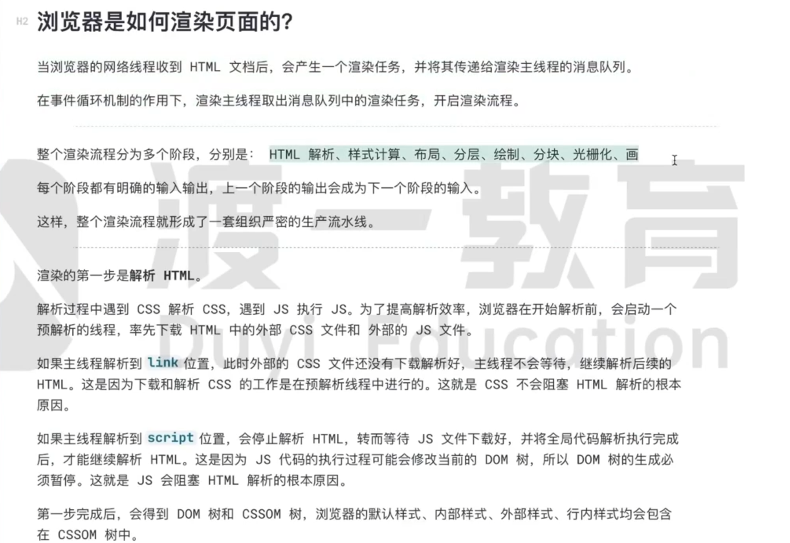

# 浏览器的工作原理

🎉🎉🎉 页面参考：

- [浏览器工作原理与实践：极客浏览器工作原理与实践](https://blog.poetries.top/browser-working-principle/)
- [浏览器的工作原理：新式网络浏览器幕后揭秘](https://www.html5rocks.com/zh/tutorials/internals/howbrowserswork/)
- [浏览器的工作原理：新式网络浏览器幕后揭秘](https://www.html5rocks.com/zh/tutorials/internals/howbrowserswork/)

## 浏览器事件循环

## 浏览器渲染过程

- 解析 html，构建 dom 树，解析 css，构建 css 树

  

  

  - 解析到 link css 时，会先预解析器先下载和解析 css, css 解析不耽误浏览器解析 html，会有一个新的新的线程去下载和解析 css

    

  - 解析到 script 时，会暂停解析 html，先下载和解析 js,因为 js 代码的执行过程中可能会修改 dom 树，所以解析 js 的时候会暂停解析 html，js 代码执行完之后才会继续解析 html

  

::: danger
这一步完成后，会生成渲染树，渲染树只包含需要显示的节点和这些节点的样式信息，不包含隐藏的节点和不可见的节点
:::

- 样式计算

  - 样式计算是为了确定每个节点在屏幕上的显示样式，这个阶段会根据 css 规则，确定每个节点的样式，这个过程是递归的，因为 css 规则可以嵌套，比如一个节点可以应用多个样式规则，或者一个样式规则可以应用到多个节点上

  

- 布局

  - 布局是为了确定每个节点在屏幕上的位置和大小，这个阶段会根据渲染树和样式信息，确定每个节点的位置和大小，这个过程是递归的，因为一个节点可以包含多个子节点，所以需要递归地确定每个节点的位置和大小

  

- 分层

  - 分层是为了将页面分成多个图层，每个图层可以独立地渲染，这样可以提高渲染效率，因为如果一个图层中的某个节点发生了变化，只需要重新渲染这个图层，而不需要重新渲染整个页面

  

- 绘制

  - 绘制是将每个图层中的节点绘制到屏幕上，这个过程是递归的，因为一个图层可以包含多个节点，所以需要递归地绘制每个节点

- 合成

  - 合成是将所有图层合成到一个图层中，这个阶段会根据图层的顺序，将每个图层中的节点绘制到屏幕上，这个过程是递归的，因为一个图层可以包含多个节点，所以需要递归地合成每个节点

> 总结

