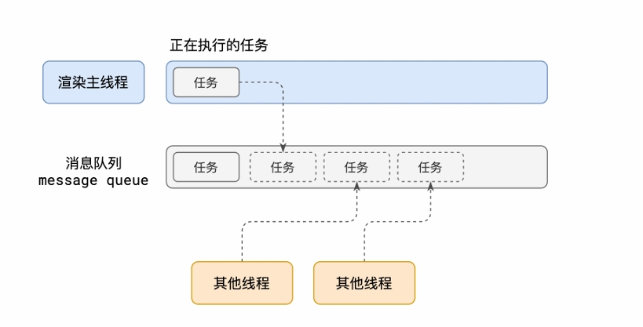
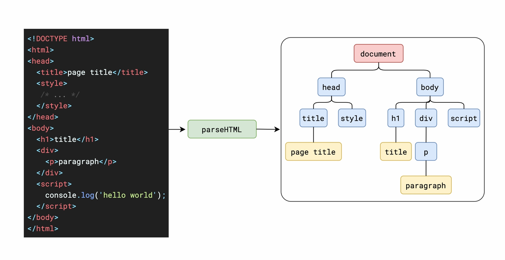

# 浏览器的工作原理

🎉🎉🎉 页面参考：

- [浏览器工作原理与实践：极客浏览器工作原理与实践](https://blog.poetries.top/browser-working-principle/)
- [浏览器的工作原理：新式网络浏览器幕后揭秘](https://www.html5rocks.com/zh/tutorials/internals/howbrowserswork/)
- [浏览器的工作原理：新式网络浏览器幕后揭秘](https://www.html5rocks.com/zh/tutorials/internals/howbrowserswork/)

## 浏览器事件循环

### 浏览器有哪些进程和线程

1. 浏览器进程

   主要负责界⾯显示、⽤户交互、⼦进程管理等。浏览器进程内部会启动多个
   线程处理不同的任务。

2. ⽹络进程

   负责加载⽹络资源。⽹络进程内部会启动多个线程来处理不同的⽹络任务。

3. 渲染进程

   渲染进程启动后，会开启⼀个渲染主线程，主线程负责执⾏ HTML、CSS、
   JS 代码。
   默认情况下，浏览器会为每个标签⻚开启⼀个新的渲染进程，以保证不同的
   标签⻚之间不相互影响

### 渲染主线程是如何⼯作的？

- 渲染主线程是浏览器中最繁忙的线程，需要它处理的任务包括但不限于：
- 解析 HTML
- 解析 CSS
- 计算样式
- 布局
- 处理图层
- 每秒把⻚⾯画 60 次
- 执⾏全局 JS 代码
- 执⾏事件处理函数
- 执⾏计时器的回调函

1. 在最开始的时候，渲染主线程会进⼊⼀个⽆限循环
2. 每⼀次循环会检查消息队列中是否有任务存在。如果有，就取出第⼀个任务
   执⾏，执⾏完⼀个后进⼊下⼀次循环；如果没有，则进⼊休眠状态。
3. 其他所有线程（包括其他进程的线程）可以随时向消息队列添加任务。新任
   务会加到消息队列的末尾。在添加新任务时，如果主线程是休眠状态，则会
   将其唤醒以继续循环拿取任务
   这样⼀来，就可以让每个任务有条不紊的、持续的进⾏下去了。
   整个过程，被称之为事件循环（消息循环）

### 异步任务

代码在执⾏过程中，会遇到⼀些⽆法⽴即处理的任务，⽐如：

- 计时完成后需要执⾏的任务 ——setTimeout 、setInterval

- ⽹络通信完成后需要执⾏的任务 --XHR 、Fetch

- ⽤户操作后需要执⾏的任务 --addEventListener

> 如果让渲染主线程等待这些任务的时机达到，就会导致主线程⻓期处于「阻塞」的状态，从⽽导致浏览器「卡死」。

**渲染主线程承担着极其重要的⼯作，⽆论如何都不能阻塞！**

因此，浏览器选择异步来解决这个问题

使⽤异步的⽅式，**渲染主线程永不阻塞**

::: info

**面试题**

1、如何理解 JS 的异步？

参考答案：
JS 是⼀⻔单线程的语⾔，这是因为它运⾏在浏览器的渲染主线程中，⽽渲染
主线程只有⼀个。
⽽渲染主线程承担着诸多的⼯作，渲染⻚⾯、执⾏ JS 都在其中运⾏。
如果使⽤同步的⽅式，就极有可能导致主线程产⽣阻塞，从⽽导致消息队列
中的很多其他任务⽆法得到执⾏。这样⼀来，⼀⽅⾯会导致繁忙的主线程⽩
⽩的消耗时间，另⼀⽅⾯导致⻚⾯⽆法及时更新，给⽤户造成卡死现象。

所以浏览器采⽤异步的⽅式来避免。具体做法是当某些任务发⽣时，⽐如计
时器、⽹络、事件监听，主线程将任务交给其他线程去处理，⾃身⽴即结束
任务的执⾏，转⽽执⾏后续代码。当其他线程完成时，将事先传递的回调函
数包装成任务，加⼊到消息队列的末尾排队，等待主线程调度执⾏。
在这种异步模式下，浏览器永不阻塞，从⽽最⼤限度的保证了单线程的流畅
运⾏。

2、阐述⼀下 JS 的事件循环

参考答案：
事件循环⼜叫做消息循环，是浏览器渲染主线程的⼯作⽅式。
在 Chrome 的源码中，它开启⼀个不会结束的 for 循环，每次循环从消息
队列中取出第⼀个任务执⾏，⽽其他线程只需要在合适的时候将任务加⼊到
队列末尾即可。

过去把消息队列简单分为宏队列和微队列，这种说法⽬前已⽆法满⾜复杂的
浏览器环境，取⽽代之的是⼀种更加灵活多变的处理⽅式。

根据 W3C 官⽅的解释，每个任务有不同的类型，同类型的任务必须在同⼀
个队列，不同的任务可以属于不同的队列。不同任务队列有不同的优先级，
在⼀次事件循环中，由浏览器⾃⾏决定取哪⼀个队列的任务。但浏览器必须
有⼀个微队列，微队列的任务⼀定具有最⾼的优先级，必须优先调度执⾏。

3、JS 中的计时器能做到精确计时吗？为什么？

参考答案：不能

1. 计算机硬件没有原⼦钟，⽆法做到精确计时

2. 操作系统的计时函数本身就有少量偏差，由于 JS 的计时器最终调⽤的
   是操作系统的函数，也就携带了这些偏差

3. 按照 W3C 的标准，浏览器实现计时器时，如果嵌套层级超过 5 层，
   则会带有

4. 受事件循环的影响，计时器的回调函数只能在主线程空闲时运⾏，因此
   ⼜带来了偏差

:::

## 浏览器渲染原理

### 渲染时间点

### 渲染流⽔线

- 解析 html，构建 dom 树，解析 css，构建 css 树

  

  

  - 解析到 link css 时，会先预解析器先下载和解析 css, css 解析不耽误浏览器解析 html，会有一个新的新的线程去下载和解析 css

    

  - 渲染主线程遇到 JS 时必须暂停⼀切⾏为，等待下载执⾏完后才能继续预解析线程可以分担⼀点下载 JS 的任务

  

::: danger
这一步完成后，会生成渲染树，渲染树只包含需要显示的节点和这些节点的样式信息，不包含隐藏的节点和不可见的节点
:::

#### 样式计算 - Recalculate Style

- 样式计算是为了确定每个节点在屏幕上的显示样式，这个阶段会根据 css 规则，确定每个节点的样式，这个过程是递归的，因为 css 规则可以嵌套，比如一个节点可以应用多个样式规则，或者一个样式规则可以应用到多个节点上

#### 布局 - Layout

- 布局是为了确定每个节点在屏幕上的位置和大小，这个阶段会根据渲染树和样式信息，确定每个节点的位置和大小，这个过程是递归的，因为一个节点可以包含多个子节点，所以需要递归地确定每个节点的位置和大小

**DOM 树 和 Layout 树不⼀定是⼀⼀对应的**

- display:none 的节点不会被加⼊到 Layout 树中，但是会被加⼊到 Render 树中
- visibility: hidden 的节点会被加⼊到 Layout 树和 Render 树中，但是不会显示
- 还有很多其他情况，⽐如浮动、绝对定位, 伪元素等

#### 分层 - Layer

- 分层是为了将页面分成多个图层，每个图层可以独立地渲染，这样可以提高渲染效率，因为如果一个图层中的某个节点发生了变化，只需要重新渲染这个图层，而不需要重新渲染整个页面

#### 绘制 - Paint

**绘制是将每个图层中的节点绘制到屏幕上，这个过程是递归的，因为一个图层可以包含多个节点，所以需要递归地绘制每个节点**

- 这⾥的绘制，是为每⼀层⽣成如何绘制的指令，⽽不是执⾏绘制。具体的绘制操作，在合成阶段，由合成线程完成

- 渲染主线程的⼯作到此为⽌，剩余步骤交给其他线程完成

  

#### 分块 - Tiling

**分块的⼯作是交给多个线程同时进⾏的**、

#### 光栅化 - Raster

- 光栅化是将每个块变成位图, 优先处理靠近视⼝的块

- 此过程会⽤到 GPU 加速

#### 画 - Draw

**合成线程计算出每个位图在屏幕上的位置，交给 GPU 进⾏最终呈现**

::: info

浏览器是如何渲染页面的?

当浏览器的网络线程收到 HTML 文档后，会产生一个渲染任务，并将其传递给渲染主线程的消息队列。

在事件循环机制的作用下，渲染主线程取出消息队列中的渲染任务，开启渲染流程。

整个渲染流程分为多个阶段，分别是: HTML 解析、样式计算、布局、分层、绘制、分块、光栅化、画

每个阶段都有明确的输入输出，上一个阶段的输出会成为下一个阶段的输入。
这样，整个渲染流程就形成了一套组织严密的生产流水线。

渲染的第一步是解析 HTML。

解析过程中遇到 CSS 解析 CSS，遇到 JS 执行 JS。为了提高解析效率，浏览器在开始解析前，会启动一个预解析的线程，率先下载 HTML 中的外部 CSS 文件和 外部的 JS 文件。

如果主线程解析到 link 位置，此时外部的 CSS 文件还没有下载解析好，主线程不会等待，继续解析后续的 HTML。这是因为下载和解析 CSS 的工作是在预解析线程中进行的。这就是 CSS 不会阻塞 HTML 解析的根本原因。

如果主线程解析到 script 位置，会停止解析 HTML，转而等待 JS 文件下载好，并将全局代码解析执行完成后，才能继续解析 HTML。这是因为 JS 代码的执行过程可能会修改当前的 DOM 树，所以 DOM 树的生成必须暂停。这就是 JS 会阻塞 HTML 解析的根本原因。

第一步完成后，会得到 DOM 树和 CSSOM 树，浏览器的默认样式、内部样式、外部样式、行内样式均会包含在 CSSOM 树中。
:::
